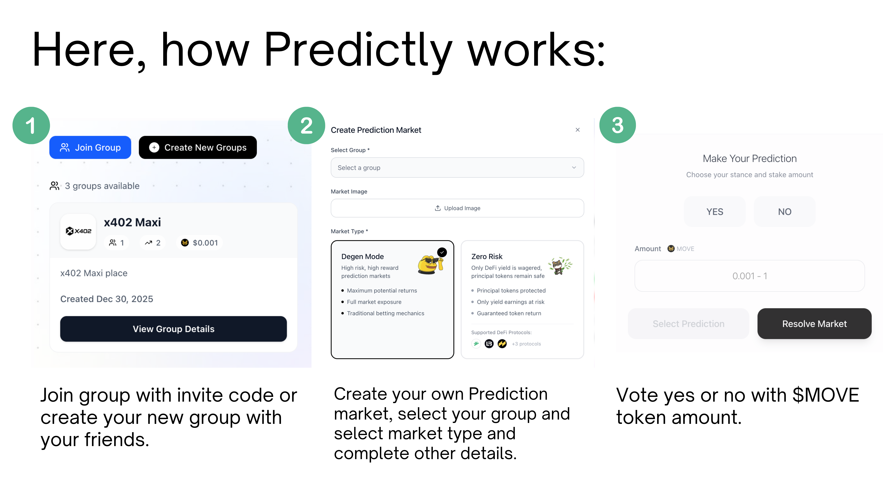

# Getting Started

Welcome to Predictly! This guide will help you get started in 5 minutes.

<figure><figcaption><p>Step-by-step guide how Predictly works</p></figcaption></figure>

## What You'll Need

- A web browser (Chrome, Firefox, Safari, or Edge)
- A Web3 wallet (Nightly, Petra, or Martian)
- A few MOVE tokens (get free testnet tokens)

## Step 1: Connect Your Wallet

1. Install a wallet ([Nightly](https://wallet.nightly.app/), [Petra](https://petra.app/), or [Martian](https://martianwallet.xyz/))
2. Go to [Predictly](https://predictly-labs.vercel.app)
3. Click **"Connect Wallet"**
4. Select your wallet
5. Approve the connection
6. ✅ Connected!

**Need help?** See [Wallet Setup Guide](Wallet-Setup.md)

---

## Step 2: Get Test MOVE Tokens

You need MOVE tokens to participate in predictions.

### Get Free Testnet Tokens

1. Go to [Movement Faucet](https://faucet.movementnetwork.xyz/)
2. Enter your wallet address
   - Find it in top-right corner of Predictly
   - Or copy from your wallet app
3. Click **"Request Tokens"**
4. Wait 10-30 seconds
5. ✅ You'll receive 1 MOVE

**Note:** Testnet tokens have no real value. They're for testing only!

---

## Step 3: Join or Create a Group

### Join an Existing Group

1. Get an invite code from a friend
2. Click **"Join Group"** in sidebar
3. Enter the invite code
4. Click **"Join"**
5. ✅ You're now a member!

**Example invite code:** `KOS-SQUAD-2026`

### Create Your Own Group

1. Click **"Create Group"**
2. Fill in details:
   - **Name:** Your group name (e.g., "Kos Squad")
   - **Description:** What's your group about?
   - **Icon:** Upload an image (optional)
3. Click **"Create"**
4. ✅ Get your unique invite code
5. Share the code with friends!

**Tip:** You become the admin automatically and can assign judges.

---

## Step 4: Browse Markets

### Find Interesting Predictions

**Public Markets:**

1. Click **"Explore"** in sidebar
2. Browse all public markets
3. Filter by:
   - Active / Pending / Resolved
   - Category
   - Time remaining

**Group Markets:**

1. Go to **"My Groups"**
2. Select a group
3. See group-exclusive markets

### Market Information

Each market shows:

- **Title:** The prediction question
- **Description:** Detailed criteria
- **Deadline:** When voting closes
- **Pool:** Total MOVE staked
- **Odds:** YES vs NO percentages
- **Participants:** Number of voters

---

## Step 5: Place Your First Vote

### How to Vote

1. Click on a market
2. Choose **YES** or **NO**
3. Enter stake amount (minimum 0.1 MOVE)
4. Review:
   - Your prediction
   - Stake amount
   - Potential reward
5. Click **"Place Vote"**
6. Approve transaction in wallet
7. ✅ Vote placed!

**Example:**

```
Market: "Will Bitcoin reach $100k by end of 2026?"
Your vote: YES
Stake: 1 MOVE
Current odds: 60% YES, 40% NO
Potential reward: ~0.67 MOVE profit
```

**Tip:** Start small! Try 0.1-0.5 MOVE for your first vote.

---

## Step 6: Wait for Resolution

### What Happens Next

1. **Voting Phase:** Others can vote until deadline
2. **Deadline Passes:** Voting closes
3. **Judge Resolution:** Judge verifies outcome
4. **Payout:** Winners can claim rewards

### Track Your Votes

1. Go to **"My Predictions"**
2. See all your active votes
3. Check status:
   - 🟢 **Active:** Still voting
   - 🟡 **Pending:** Waiting for judge
   - ✅ **Won:** You won!
   - ❌ **Lost:** Better luck next time

---

## Step 7: Claim Your Rewards

### If You Won

1. Go to **"My Predictions"**
2. Find resolved markets where you won
3. Click **"Claim Reward"**
4. Approve transaction
5. ✅ MOVE tokens sent to your wallet!

**Example:**

```
You voted: YES with 1 MOVE
Result: YES won
Your reward: 1.67 MOVE
Profit: 0.67 MOVE (+67%)
```

**See detailed guide:** [Claiming Rewards](Claiming-Rewards.md)

---

## Quick Tips

### For New Users

✅ **Start small** - Use 0.1-0.5 MOVE for first votes\
✅ **Read criteria** - Understand how market will be resolved\
✅ **Check judge** - Make sure judge is trustworthy\
✅ **Join groups** - More fun with friends!\
✅ **Track performance** - Learn from wins and losses

### Common Mistakes to Avoid

❌ **Don't stake more than you can afford to lose**\
❌ **Don't vote on unclear markets**\
❌ **Don't trust unknown judges**\
❌ **Don't forget to claim rewards**\
❌ **Don't vote after deadline (won't work)**

---

## What's Next?

### Learn More

- [Wallet Setup](Wallet-Setup.md) - Detailed wallet guide
- [Creating Markets](Creating-Markets.md) - Make your own predictions
- [Voting Guide](Voting-Guide.md) - Advanced voting strategies
- [Groups](../Products/Groups.md) - Group features explained

### Get Help

- Check [FAQ](../Resources/FAQ.md)
- Join [Community](../Resources/Community.md)
- Read [Troubleshooting](../Resources/Troubleshooting.md)

---

## Summary

**You learned how to:**

1. ✅ Connect Web3 wallet
2. ✅ Get test MOVE tokens
3. ✅ Join or create groups
4. ✅ Browse markets
5. ✅ Place votes
6. ✅ Wait for resolution
7. ✅ Claim rewards

**Ready to predict?** [Start Now →](https://predictly-labs.vercel.app)

---

**Need Help?** Join our [Discord](../Resources/Community.md) or check [Troubleshooting](../Resources/Troubleshooting.md)
