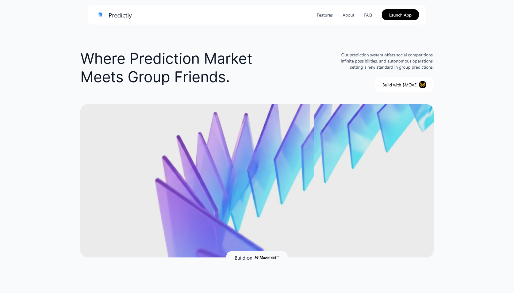

# Prediction Markets

Predictly offers three types of prediction markets, each designed for different risk appetites and use cases.

## Market Types Overview

<figure><figcaption>
Comparison of three market types: Full Degen, Zero Loss, and Private markets
</figcaption></figure>

| Type                            | Risk   | Reward           | Best For                    | Status  |
| ------------------------------- | ------ | ---------------- | --------------------------- | ------- |
| [**Full Degen**](Full-Degen.md) | High   | High (2x-10x)    | High conviction predictions | ✅ Live |
| [**Zero Loss**](Zero-Loss.md)   | None   | Low (yield only) | Risk-averse users           | ✅ Live |
| [**Private**](Private.md)       | Varies | Varies           | Friend groups only          | ✅ Live |

---

## Full Degen Markets

**Standard prediction markets with full risk/reward.**

- Winners take the entire losing pool
- High risk, high potential returns
- Most popular market type
- Available for public and private groups

**Example:** Stake 1 MOVE on YES, if you win, earn proportional share of NO pool.

[Learn More →](Full-Degen.md)

---

## Zero Loss Markets

**Protected markets using DeFi yield farming.**

- Your principal is always protected
- Only the yield is distributed to winners
- Perfect for risk-averse users
- Planned for Q1 2025 launch

**Example:** Stake 10 MOVE, always get 10 MOVE back. Winners split the yield generated.

[Learn More →](Zero-Loss.md)

---

## Private Markets

**Exclusive prediction markets for specific groups.**

- Only group members can see and participate
- Perfect for friend predictions
- Custom judges from your group
- Full privacy control

**Example:** "Will John finish his thesis by end of month?" - Only your friend group can vote.

[Learn More →](Private.md)

---

## How to Choose

### Choose Full Degen if:

- ✅ You have high conviction
- ✅ You're comfortable with risk
- ✅ You want maximum returns
- ✅ Short or long-term predictions

### Choose Zero Loss if:

- ✅ You want zero risk
- ✅ You prefer steady, safe returns
- ✅ You have large amounts to stake
- ✅ Long-term predictions (30+ days)

### Choose Private if:

- ✅ You want predictions with friends only
- ✅ You need privacy
- ✅ You have trusted judges in your group
- ✅ Personal or sensitive topics

---

## Getting Started

1. **Connect Wallet** - Use Nightly, Petra, or Martian
2. **Get MOVE Tokens** - From the [faucet](https://faucet.movementnetwork.xyz/)
3. **Browse Markets** - Explore public or join a group
4. **Place Your Vote** - Choose YES or NO and stake
5. **Claim Rewards** - If you win, claim your earnings

[Start Now →](https://predictly-movement.vercel.app)

---

**Next Steps:**

- [How to Create Markets](../../How-It-Works/Creating-Markets.md)
- [Voting Guide](../../How-It-Works/Voting-Guide.md)
- [Groups & Communities](../Groups.md)
