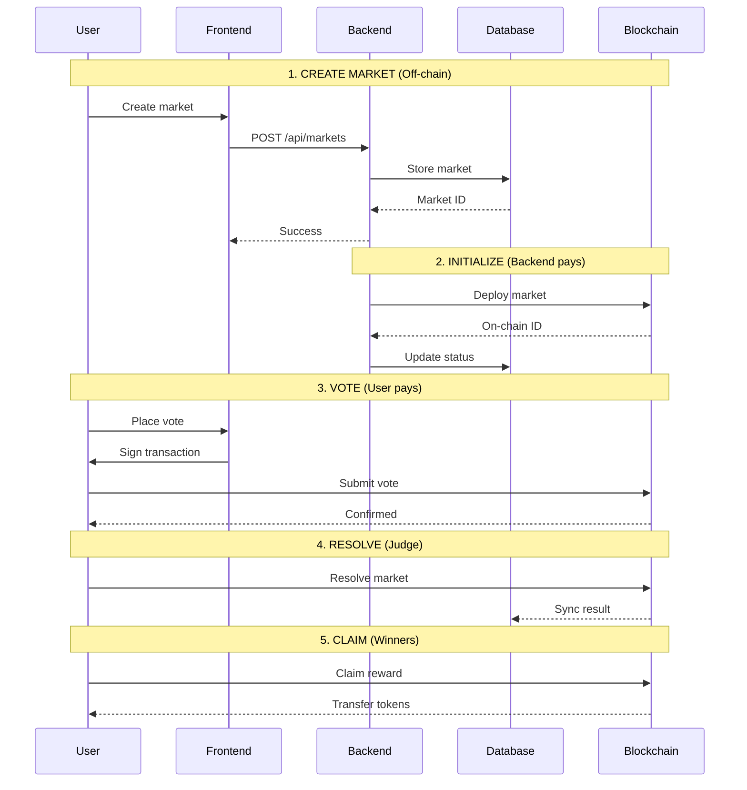

# How It Works

This page provides a high-level overview of how Predictly works. For detailed technical information, see [System Architecture](../how-it-works/system-architecture.md).

## 🎯 Simple Overview

Predictly works in four simple steps:

```
1. CREATE          2. VOTE           3. RESOLVE        4. CLAIM
   Market  →         on Outcome  →     Market    →       Rewards

   📝 Free           💰 Stake          ⚖️ Judge          🏆 Winners
   Off-chain         On-chain          On-chain          On-chain
```

Let's dive into each step:

---

## 1️⃣ Create a Market

Anyone can create a prediction market on any topic.

### Process

1. **Connect Wallet** - Connect your Nightly, Petra, or Martian wallet
2. **Fill Details** - Add title, description, deadline, and image
3. **Set Parameters** - Choose market type and group (if private)
4. **Submit** - Create market instantly (no gas fees!)

### What Happens

- Market is created **off-chain** in database
- Status: `PENDING`
- **No gas fees** for creator
- Market appears in group/public feed

### Example

```
Title: "Will Bitcoin reach $100k by end of 2026?"
Description: "Bitcoin must reach or exceed $100,000 USD..."
Deadline: 2026-12-31 23:59:59 UTC
Type: Full Degen
Group: Crypto Enthusiasts
```

[Learn how to create your first market →](../getting-started/first-market.md)

---

## 2️⃣ Initialize Market (Backend)

After creation, the market is initialized on the blockchain.

### Process

1. **Automatic** - Backend detects new market
2. **Deploy to Blockchain** - Backend calls smart contract
3. **Backend Pays Gas** - No cost to creator
4. **Get On-Chain ID** - Market gets blockchain ID

### What Happens

- Market is deployed to **Movement Network**
- Status changes to `ACTIVE`
- Users can now vote
- Market is **verifiable on blockchain**

### Technical Details

```typescript
// Backend calls smart contract
await aptosClient.transaction.build.simple({
  sender: relayWallet.address,
  data: {
    function: `${CONTRACT_ADDRESS}::predictly::create_market`,
    functionArguments: [title, description, deadline],
  },
});
```

[Learn more about the hybrid system →](../developers/architecture/hybrid-system.md)

---

## 3️⃣ Vote on Markets

Users stake MOVE tokens on their predictions.

### Process

1. **Choose Market** - Browse active markets
2. **Select Outcome** - Vote YES or NO
3. **Enter Stake** - Amount of MOVE tokens
4. **Sign Transaction** - Approve with wallet
5. **Confirm** - Vote recorded on blockchain

### What Happens

- Tokens are **locked in smart contract**
- Vote is **recorded on-chain**
- User **pays their own gas**
- Vote appears in market stats

### Voting Rules

- ✅ Can vote multiple times (increases stake)
- ✅ Can vote on both YES and NO
- ❌ Cannot withdraw before resolution
- ❌ Cannot vote after deadline

### Example Transaction

```typescript
// User signs transaction with wallet
const transaction = {
  function: `${CONTRACT_ADDRESS}::predictly::place_vote`,
  arguments: [
    marketId, // 1
    voteOption, // true (YES) or false (NO)
    stakeAmount, // 1000000000 (10 MOVE in octas)
  ],
};
```

[Learn how to vote →](../guides-tutorials/user-guides/place-vote.md)

---

## 4️⃣ Resolve Market

After the deadline, a judge determines the outcome.

### Process

1. **Deadline Passes** - Market voting closes
2. **Judge Reviews** - Judge checks real-world outcome
3. **Submit Resolution** - Judge resolves on-chain
4. **Record Outcome** - Result stored on blockchain

### What Happens

- Market status changes to `RESOLVED`
- Winning outcome is recorded
- Rewards are calculated
- Winners can claim rewards

### Judge Role

Judges are **trusted members** assigned by group admins:

- ⚖️ Determine the true outcome
- 🔍 Must be objective and fair
- 📝 Resolution is permanent
- 🏆 Reputation at stake

### Resolution Options

- **YES** - The prediction came true
- **NO** - The prediction did not come true
- **INVALID** - Market should be cancelled (coming soon)

[Learn more about the Judge System →](../products-features/judge-system.md)

---

## 5️⃣ Claim Rewards

Winners claim their share of the reward pool.

### Process

1. **Check Status** - See if you won
2. **View Reward** - See your reward amount
3. **Claim** - Sign transaction to claim
4. **Receive Tokens** - MOVE tokens sent to wallet

### What Happens

- Smart contract calculates your share
- Tokens are **transferred to your wallet**
- Claim is **recorded on-chain**
- You **pay gas for claim transaction**

### Reward Calculation

```
Your Reward = (Your Stake / Total Winning Stake) × Total Losing Stake
```

**Example:**

- You voted YES with 10 MOVE
- Total YES votes: 100 MOVE
- Total NO votes: 50 MOVE
- Market resolved: YES
- Your reward: (10 / 100) × 50 = 5 MOVE
- You get back: 10 + 5 = **15 MOVE**

[Learn how to claim rewards →](../guides-tutorials/user-guides/claim-rewards.md)

---

## 🔄 Complete Flow Diagram



---

## 🎨 User Journey

### New User Journey

1. **Discover** - Find Predictly through friends/social media
2. **Connect** - Connect wallet (no signup required)
3. **Explore** - Browse active markets
4. **Join Group** - Use invite code to join friend's group
5. **First Vote** - Place first prediction
6. **Wait** - Watch market progress
7. **Win** - Market resolves in your favor
8. **Claim** - Claim your first reward
9. **Create** - Create your own market
10. **Repeat** - Keep predicting and earning

### Power User Journey

1. **Create Group** - Start your own prediction community
2. **Invite Friends** - Share invite code
3. **Assign Judges** - Designate trusted judges
4. **Create Markets** - Regular prediction challenges
5. **Compete** - Climb the leaderboard
6. **Build Reputation** - Become known for accuracy
7. **Earn** - Consistent profits from predictions

---

## 🔑 Key Concepts

### Hybrid Architecture

Predictly uses both **off-chain** and **on-chain** components:

| Action            | Location  | Who Pays | Why                 |
| ----------------- | --------- | -------- | ------------------- |
| Create Market     | Off-chain | Free     | Fast, no barriers   |
| Initialize Market | On-chain  | Backend  | User doesn't pay    |
| Vote              | On-chain  | User     | User controls funds |
| Resolve           | On-chain  | Judge    | Transparent result  |
| Claim             | On-chain  | Winner   | Receive rewards     |

**Benefits:**

- ⚡ Fast market creation
- 💰 Lower costs for users
- 🔒 Blockchain security
- 📊 Quick data access

[Learn more →](../how-it-works/hybrid-flow.md)

---

### Trust Model

Predictly balances **decentralization** with **usability**:

**Decentralized:**

- ✅ Voting on blockchain
- ✅ Resolution on blockchain
- ✅ Rewards on blockchain
- ✅ Verifiable outcomes

**Centralized (for UX):**

- 📊 Market metadata in database
- ⚡ Fast data queries
- 🖼️ Image storage (IPFS)
- 🔄 Data syncing

**Trust Required:**

- ⚖️ Judges to resolve fairly
- 🔧 Backend to initialize markets
- 🔄 Backend to sync data

---

## 🚀 Next Steps

Now that you understand how Predictly works:

1. **[Get Started](../getting-started/quick-start.md)** - Start using Predictly
2. **[Create Market](../getting-started/first-market.md)** - Create your first market
3. **[Join Group](../getting-started/joining-groups.md)** - Join a community
4. **[Deep Dive](../how-it-works/system-architecture.md)** - Learn technical details

---

**Next:** [Quick Start Guide →](../getting-started/quick-start.md)
